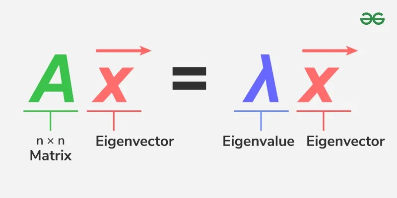

# Eigenvalues and Eigenvectors

## What are Eigenvalues and Eigenvectors?

The scalar \( \lambda \) is the corresponding **eigenvalue**. They reveal fundamental properties of linear transformations—such as stability, principal directions, and natural frequencies.

## What does this program do?

This lab implements the **Power Iteration method** to numerically approximate:
- The **dominant eigenvalue** (the one with the largest absolute value)
- Its corresponding **eigenvector**

Given a matrix and an initial guess, the algorithm repeatedly applies the matrix to the vector and normalizes it until convergence.

This method is simple, requires only matrix-vector multiplication, and is the basis for algorithms like PageRank.

## Important Notes
- Only finds the **dominant** eigenpair.
- Requires the matrix to have a unique largest eigenvalue in magnitude.
- Convergence is linear and may be slow if eigenvalues are close in size.